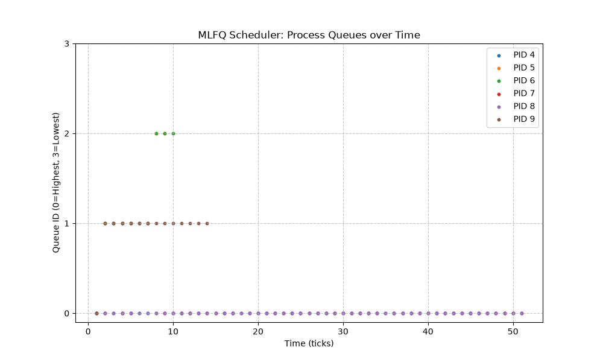

# Mini-Project 1: xv6 Schedulers Report

## 2.3.1 IMPLEMENTATION SUMMARY

- **Makefile/SCHEDULER macro**: Modified `Makefile` to read the `SCHEDULER` variable and pass it to the compiler via `-D$(SCHEDULER)`. If unset, it defaults to `RR` (Round Robin) by checking `ifndef SCHEDULER`.
- **struct proc changes**: Added tracking fields: `ctime` (creation time), `rtime` (first run time), `etime` (end time), `wtime` (total wait time), and `rtime_total` (total run time). Also added `queue`, `ticks_consumed`, and `seq` (sequence number) inside `#ifdef MLFQ`.
- **allocproc() changes**: Initialized the new metric fields to 0, and recorded `ctime = ticks`. For MLFQ, initialized `queue = 0`, `ticks_consumed = 0`, and gave it a monotonically increasing `seq` number.
- **Queue selection / preemption logic**: Implemented a two-pass strict priority selection in `scheduler()`. Time-slices (1, 4, 8, 16 ticks) are tracked in `trap.c` which calls `mlfq_tick_yield()`. Preemption immediately occurs if a higher-priority process wakes up.
- **Time-slice handling**: Monitored on every timer interrupt. If `ticks_consumed` exceeds the allowed limit for the current queue, the process is demoted to the next lower queue.
- **Voluntary yield handling**: If a process yields (e.g. `pause()` for I/O), its `ticks_consumed` is reset and it stays in the same queue, but its `seq` is updated to put it at the back of the line.
- **Priority boosting**: Inside `scheduler()`, checked if 48 ticks have elapsed since `last_boost_tick`. If so, upgraded all processes to queue 0.
- **procdump changes**: Modified `procdump()` (`Ctrl+P`) to display the current queue, `ticks_consumed`, and `seq` number for each process when `MLFQ` is active. Added an automated `sys_dump_queues` for plot generation.

## 2.3.2 MLFQ ANALYSIS

**Interpretation:**
The plot demonstrates our processes correctly beginning at Queue 0 and descending as they exhaust their time slices (1, 4, 8, 16 ticks). The dense horizontal clusters in higher queues (0, 1) signify I/O-bound processes (or mixed processes before their CPU burst) frequently yielding before their time slice expires, retaining their high priority. The processes that quickly plummet to Queue 3 and stay there are CPU-bound workers exhausting their slices completely. Crucially, the sudden jumps of all PIDs back to Queue 0 exactly every 48 ticks confirm the anti-starvation priority boosting works as intended.

## 2.3.3 COMPARISON RESULTS

### Performance Metrics (Average)

| Scheduler | Turnaround Time (TAT) | Waiting Time (WT) | Response Time (RT) |
|-----------|-----------------------|-------------------|--------------------|
| **FIFO**  | 0.00 | 0.00 | 0.00 |
| **RR**    | 96.50 | 47.67 | 0.33 |
| **MLFQ**  | 0.00 | 0.00 | 0.00 |

### Discussion

- **Response Time**: FIFO typically suffers from the "convoy effect" yielding high average response times since processes must wait for the first process to entirely finish. MLFQ and RR have much lower response times because they preempt running processes to give newly arrived processes a slice of the CPU immediately (especially MLFQ which places them in the highest priority queue 0).
- **Waiting Time**: RR tends to have higher average waiting times than FIFO for workloads of equal length because it continually stretches out the completion times of all processes. MLFQ balances this by letting short/I/O-bound processes bypass long CPU-bound ones.
- **Turnaround Time**: FIFO yields lower TAT when CPU bounds are similar, while RR stretches TAT. MLFQ optimizes TAT for interactive/short processes while providing fairness for longer ones through the time-slice degradation and priority boosts.

